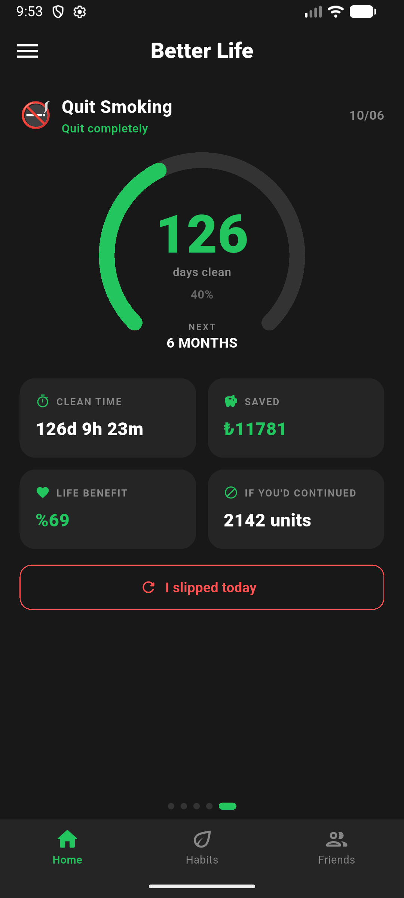
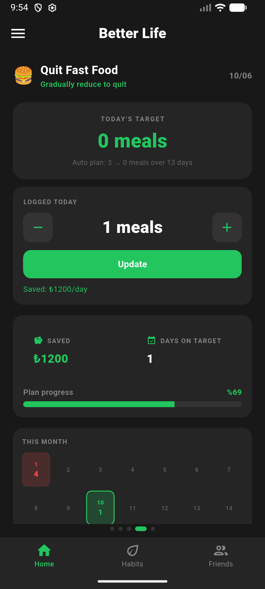
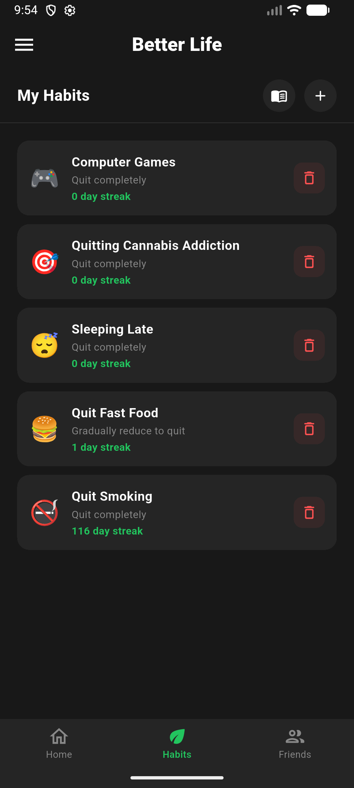
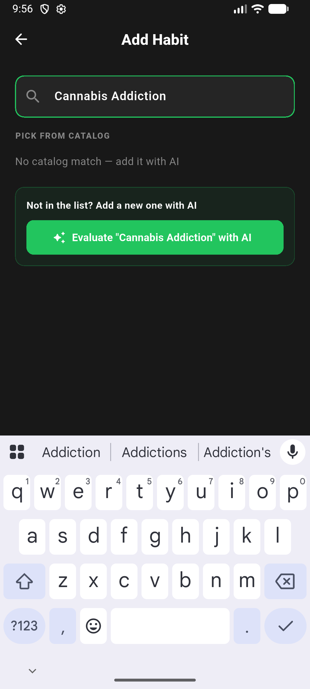
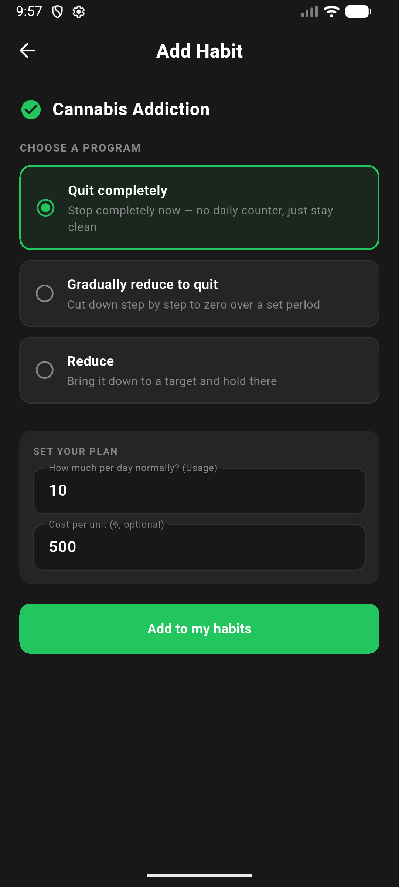
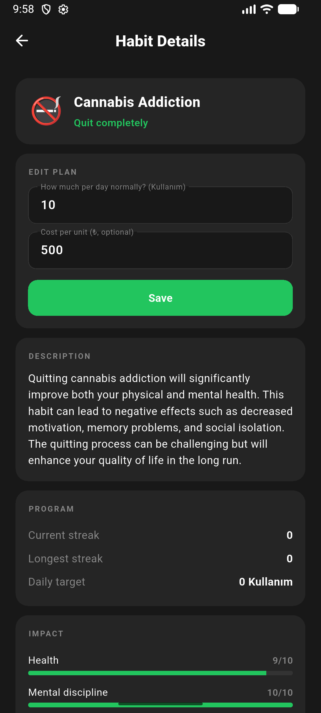
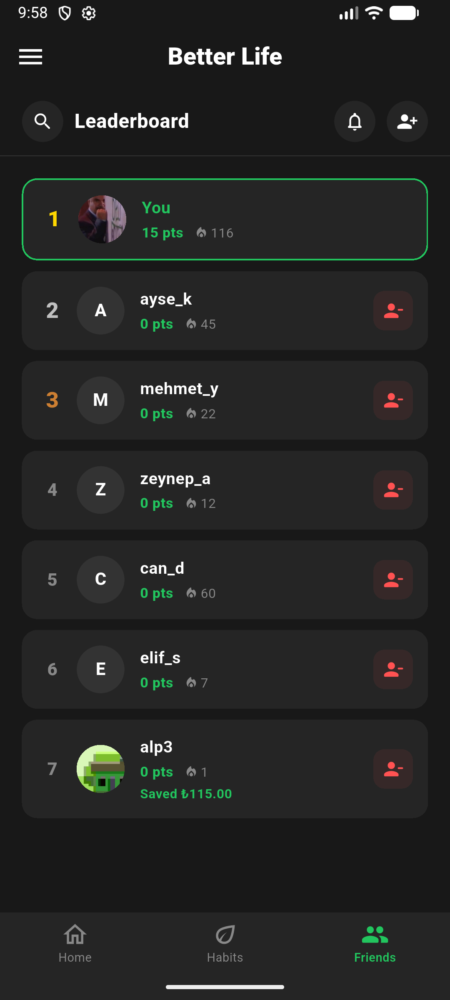
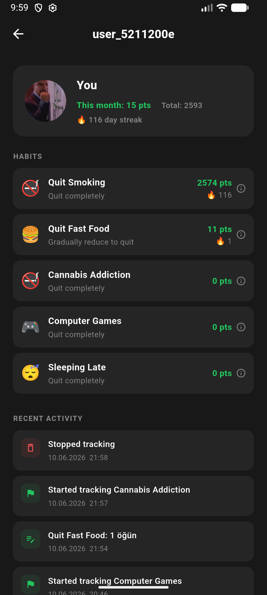
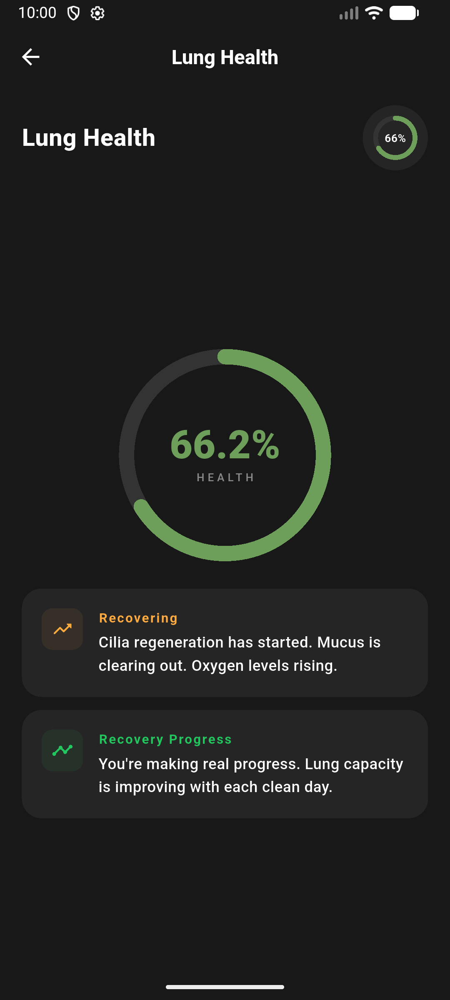
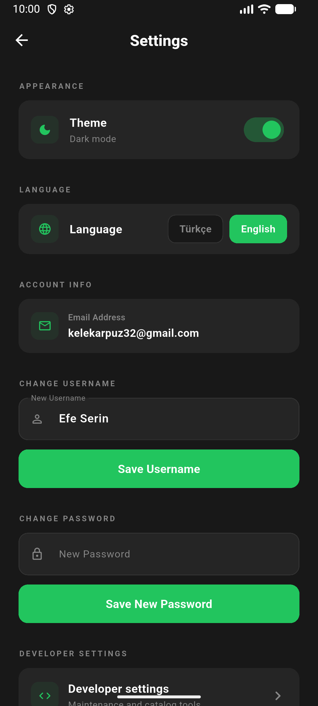

# Better Life

A habit tracking app built with Flutter that helps you quit, reduce or build habits with a gamified scoring system, streaks and a friend leaderboard.

## Features

**Multiple habit programs.** Each habit can be tracked with a different plan: quit completely (cold turkey with a clean-time counter), gradual decrease (the app calculates a daily target that shrinks over your chosen timeline), reduce to a fixed daily limit, gradual increase or maintain. Negative habits like smoking get quit oriented plans, positive ones like reading get build oriented plans.

**AI assisted habit catalog.** You can pick a habit from the shared catalog or type anything you want. New entries are evaluated by Gemini on the backend, which validates the habit, assigns an icon, a unit, difficulty and impact scores, and merges duplicates so the community catalog stays clean.

**Scoring, streaks and milestones.** Every daily log is scored server side: base points multiplied by difficulty and a streak multiplier, plus effort and milestone bonuses and penalties for missed targets. Day milestones (7, 30, 90 and so on) grant extra points, and logging several habits in a row earns combo bonuses. A log can be updated during the day and the score is recalculated correctly.

**Money and health feedback.** For habits with a unit cost the app shows how much money you saved. Quitting smoking also unlocks a lung recovery screen with medical recovery milestones.

**Social.** Add friends, compete on a monthly leaderboard and visit public profiles that show each user's habits, a transparent score breakdown for every habit, and a recent activity feed that also records streak resets and removed habits.

**Push notifications.** Firebase Cloud Messaging is integrated. Device tokens are stored in Supabase so the backend can send reminders to users who have not logged today.

**Other.** Dark and light themes, Turkish and English localization, a daily check-in dialog, confirmation dialogs for destructive actions, and a developer settings screen with maintenance tools (duplicate merge, manual catalog editing and habit deletion).

## Tech stack

- Flutter (Dart) for the mobile app
- Supabase: auth, Postgres with RLS, RPC functions and edge functions
- Google Gemini for habit evaluation on the backend
- Firebase Cloud Messaging with flutter_local_notifications for push notifications
- easy_localization for i18n

## Screenshots

| Home (quit plan) | Home (gradual reduce) | My habits |
| --- | --- | --- |
|  |  |  |

| Add habit (AI search) | Choose a program | Habit details |
| --- | --- | --- |
|  |  |  |

| Leaderboard | Profile and activity | Lung recovery |
| --- | --- | --- |
|  |  |  |

| Settings | | |
| --- | --- | --- |
|  | | |

## Getting started

1. Install Flutter 3.x and run `flutter pub get`.
2. Create `lib/supabase_options.dart` with your Supabase project URL and anon key (the file is gitignored on purpose):

```dart
const String supabaseUrl = 'https://YOUR_PROJECT.supabase.co';
const String supabaseAnonKey = 'YOUR_ANON_KEY';
```

3. Run the SQL files under `docs/sql/` in the Supabase SQL editor (device tokens, habit events, same-day log updates, admin policies).
4. For push notifications add your own `google-services.json` from Firebase and follow `docs/NOTIFICATION_SETUP.md`.
5. `flutter run`

## Project structure

```
lib/
  main.dart                       app entry, Supabase and FCM init
  auth_gate.dart                  session check and routing
  home_screen.dart                main shell with tabs and drawer
  home_habit_view.dart            per habit dashboard (counter, calendar, stats)
  habits_screen.dart              habit list, add flow and catalog
  habit_detail_screen.dart        plan editing and habit details
  friends_screen.dart             leaderboard and friend requests
  user_profile_screen.dart        public profile and activity feed
  lungs_screen.dart               lung recovery view for smoking
  settings_screen.dart            account, theme, language, developer entry
  developer_settings_screen.dart  maintenance tools
  services/
    habit_repository.dart         all Supabase access
    habit_models.dart             data models and helpers
    notification_service.dart     FCM tokens and local notifications
assets/translations/              tr.json and en.json
docs/                             setup guides and SQL migrations
```
